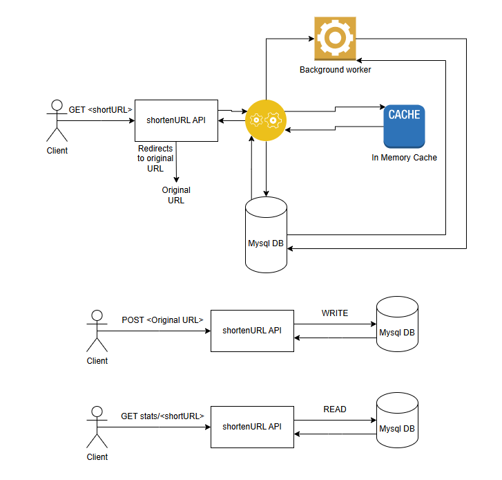

# Architectural design:

## Detailed Design consideration: 

### Three endpoints implemented: 

- POST /shorten
- GET /{short_code}
- GET stats/{short_code}
  
### Connection Pool module: 

- Thread safe connection Pool class to synchronize the access to the connection pool Queue from multiple threads weather by getting the connection (Pop operation) or releasing connection (push operation) 
- Fixed size queue is created which holds active connections to MySql database to avoid opening and closing connection overhead every time we get a read/write request. 
 

 
  
### Thread Pool module: 

- Thread safe pool class to offload heavy lifting work to be done as a background task.  
- Fixed queue size which has already running threads waiting for any task to handle. 
- Used for Short URL statistics as every time a read request hits the Api, I need to do DB write operation to increment the Short URL's counter by 1 as this operation is costly every time a read request hit, I offload writing operation to a background worker (Thread Pool) 
